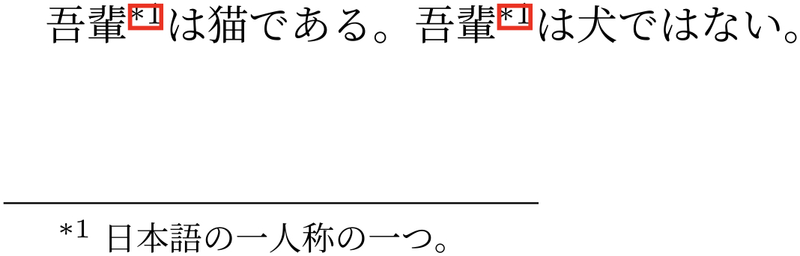

<script src="main.js"></script>

<script type="text/javascript" id="MathJax-script" async=""
src="https://cdn.jsdelivr.net/npm/mathjax@3/es5/tex-mml-chtml.js">
</script>
<script>
MathJax = {
loader: { load: ['[tex]/physics', '[tex]/newcommand', '[tex]/mathtools'] },
tex: {
inlineMath: [['$', '$'], ['\(', '\)']],
packages: { '[+]': ['physics', 'newcommand', 'mathtools'] },
},
chtml: {
matchFontHeight: false
}
};
</script>

<!-- <style>
img{
max-height:10vh;
max-width:100%;
}
video{
max-height:10vh;
max-width:100%;
}
</style> -->


# 【LaTeX】\footnoteも\refしたい

$\rm \LaTeX$ の脚注を`\footnote`で出した後もう一回同じ脚注を参照したいなってなったときは

- はじめに`\footnote{脚注の内容\label{ラベル名}}`として
- 再び参照するときは`\footref{ラベル名}`とする

だけです。特別なパッケージとかはいらないです。~~気付かないで3時間くらい無駄にしました。~~ hyperrefも対応しているみたいです。

ソースコード（platex文書）

```latex
\documentclass[dvipdfmx]{jsarticle}
\pagestyle{empty}
\usepackage{geometry}
\usepackage{hyperref}
\geometry{papersize={15cm,3cm}}
\begin{document}
吾輩\footnote{日本語の一人称の一つ。\label{fot:吾輩}}は猫である。吾輩\footref{fot:吾輩}は犬ではない。
\end{document}
```


<!-- <div style="text-align:center">

</div> -->


